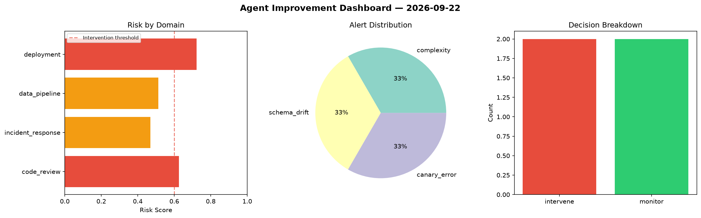
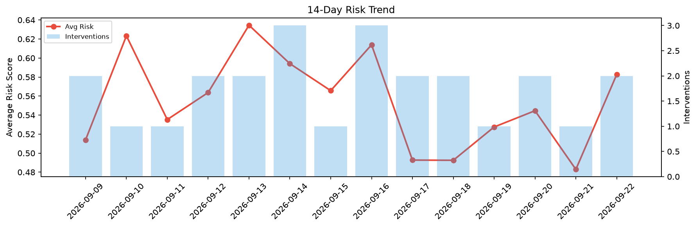

# Agent Improvement Report — 2026-09-22

**Cycle ID:** `6ec6ea70` | **Avg Risk:** 0.5827 | **Interventions:** 2/4

## Risk Matrix

| Domain | Risk Score | Decision | Alerts |
|--------|-----------|----------|--------|
| code_review | 0.6261 | intervene | complexity |
| incident_response | 0.4691 | monitor | none |
| data_pipeline | 0.5133 | monitor | schema_drift |
| deployment | 0.7223 | intervene | canary_error |

## Delta vs Yesterday

| Domain | Today | Yesterday | Change |
|--------|-------|-----------|--------|
| code_review | 0.6261 | 0.3063 | 📈 104.4% |
| incident_response | 0.4691 | 0.4317 | 📈 8.7% |
| data_pipeline | 0.5133 | 0.7138 | 📉 -28.1% |
| deployment | 0.7223 | 0.4798 | 📈 50.5% |

**Refinement:** `{'adjustment': 'tighten_thresholds', 'trend': 'degrading', 'window': 4}`