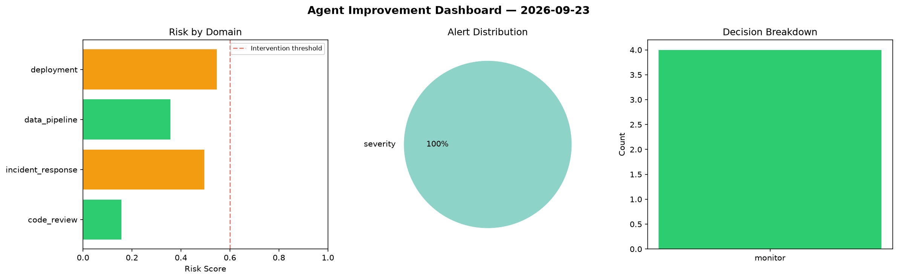
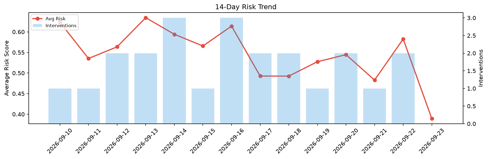

# Agent Improvement Report — 2026-09-23

**Cycle ID:** `71b2d5aa` | **Avg Risk:** 0.3892 | **Interventions:** 0/4

## Risk Matrix

| Domain | Risk Score | Decision | Alerts |
|--------|-----------|----------|--------|
| code_review | 0.1568 | monitor | none |
| incident_response | 0.4961 | monitor | severity |
| data_pipeline | 0.3574 | monitor | none |
| deployment | 0.5467 | monitor | none |

## Delta vs Yesterday

| Domain | Today | Yesterday | Change |
|--------|-------|-----------|--------|
| code_review | 0.1568 | 0.6261 | 📉 -75.0% |
| incident_response | 0.4961 | 0.4691 | 📈 5.8% |
| data_pipeline | 0.3574 | 0.5133 | 📉 -30.4% |
| deployment | 0.5467 | 0.7223 | 📉 -24.3% |

**Refinement:** `{'adjustment': 'tighten_thresholds', 'trend': 'degrading', 'window': 4}`