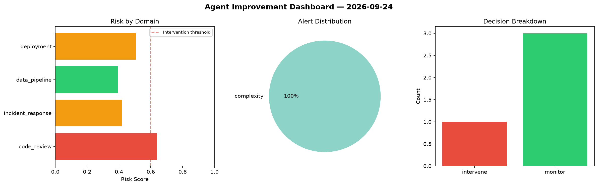
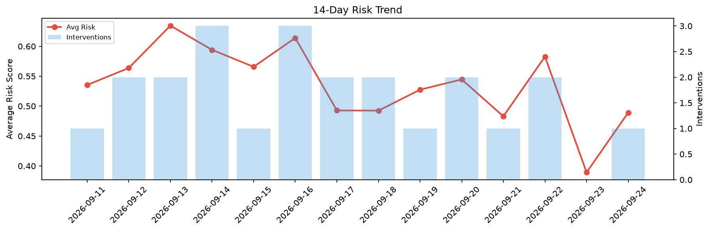

# Agent Improvement Report — 2026-09-24

**Cycle ID:** `3fd76cab` | **Avg Risk:** 0.4892 | **Interventions:** 1/4

## Risk Matrix

| Domain | Risk Score | Decision | Alerts |
|--------|-----------|----------|--------|
| code_review | 0.6406 | intervene | complexity |
| incident_response | 0.4174 | monitor | none |
| data_pipeline | 0.3921 | monitor | none |
| deployment | 0.5067 | monitor | none |

## Delta vs Yesterday

| Domain | Today | Yesterday | Change |
|--------|-------|-----------|--------|
| code_review | 0.6406 | 0.1568 | 📈 308.5% |
| incident_response | 0.4174 | 0.4961 | 📉 -15.9% |
| data_pipeline | 0.3921 | 0.3574 | 📈 9.7% |
| deployment | 0.5067 | 0.5467 | 📉 -7.3% |

**Refinement:** `{'adjustment': 'maintain', 'trend': 'improving', 'window': 4}`