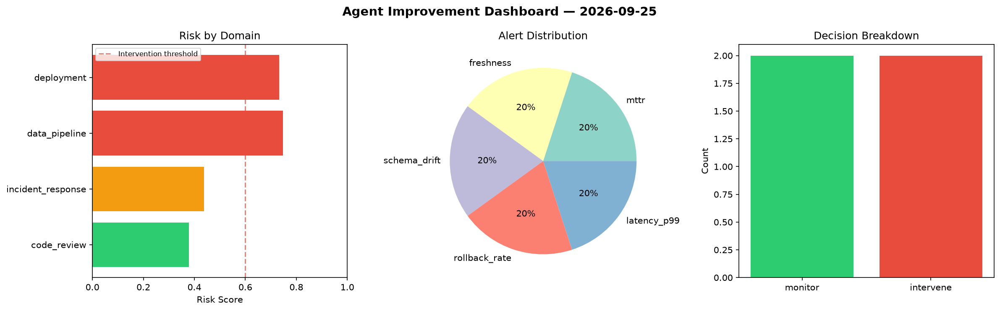
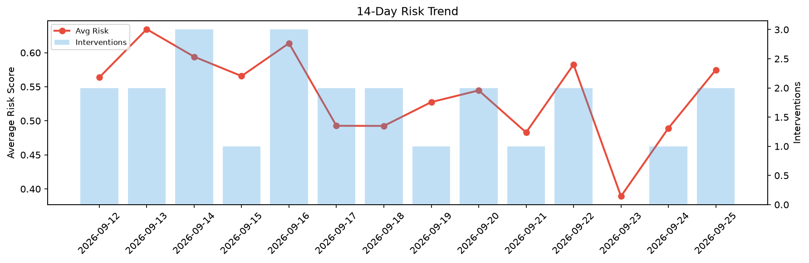

# Agent Improvement Report — 2026-09-25

**Cycle ID:** `c8132ae4` | **Avg Risk:** 0.5748 | **Interventions:** 2/4

## Risk Matrix

| Domain | Risk Score | Decision | Alerts |
|--------|-----------|----------|--------|
| code_review | 0.3794 | monitor | none |
| incident_response | 0.4383 | monitor | mttr |
| data_pipeline | 0.7479 | intervene | freshness, schema_drift |
| deployment | 0.7334 | intervene | rollback_rate, latency_p99 |

## Delta vs Yesterday

| Domain | Today | Yesterday | Change |
|--------|-------|-----------|--------|
| code_review | 0.3794 | 0.6406 | 📉 -40.8% |
| incident_response | 0.4383 | 0.4174 | 📈 5.0% |
| data_pipeline | 0.7479 | 0.3921 | 📈 90.7% |
| deployment | 0.7334 | 0.5067 | 📈 44.7% |

**Refinement:** `{'adjustment': 'tighten_thresholds', 'trend': 'degrading', 'window': 4}`