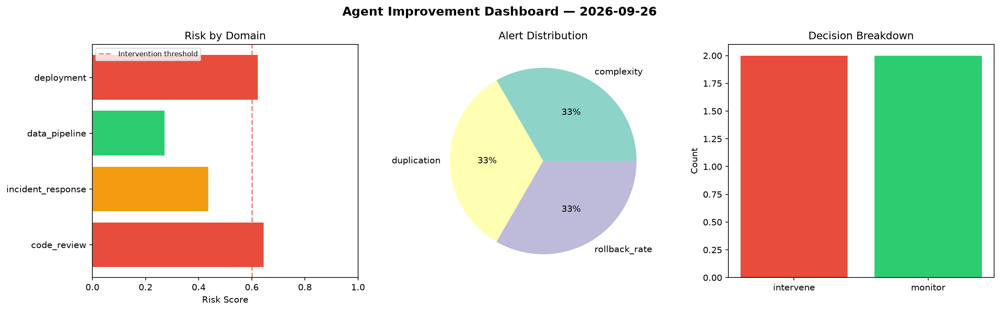
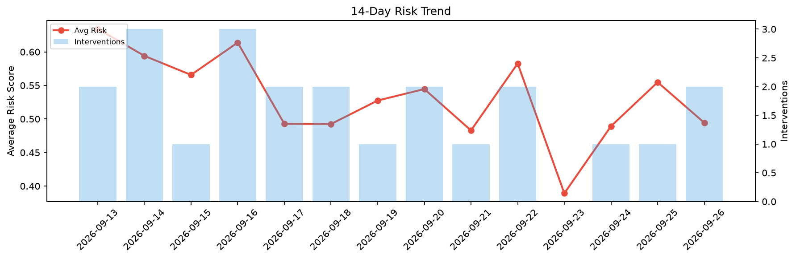

# Agent Improvement Report — 2026-09-26

**Cycle ID:** `ea7debde` | **Avg Risk:** 0.4943 | **Interventions:** 2/4

## Risk Matrix

| Domain | Risk Score | Decision | Alerts |
|--------|-----------|----------|--------|
| code_review | 0.6454 | intervene | complexity, duplication |
| incident_response | 0.4366 | monitor | none |
| data_pipeline | 0.2724 | monitor | none |
| deployment | 0.623 | intervene | rollback_rate |

## Delta vs Yesterday

| Domain | Today | Yesterday | Change |
|--------|-------|-----------|--------|
| code_review | 0.6454 | 0.5539 | 📈 16.5% |
| incident_response | 0.4366 | 0.7282 | 📉 -40.0% |
| data_pipeline | 0.2724 | 0.3813 | 📉 -28.6% |
| deployment | 0.623 | 0.5558 | 📈 12.1% |

**Refinement:** `{'adjustment': 'maintain', 'trend': 'improving', 'window': 4}`