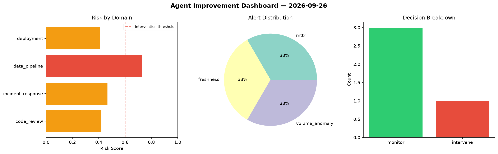
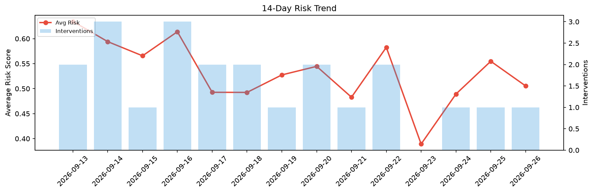

# Agent Improvement Report — 2026-09-26

**Cycle ID:** `a82bf10c` | **Avg Risk:** 0.5055 | **Interventions:** 1/4

## Risk Matrix

| Domain | Risk Score | Decision | Alerts |
|--------|-----------|----------|--------|
| code_review | 0.421 | monitor | none |
| incident_response | 0.4666 | monitor | mttr |
| data_pipeline | 0.7272 | intervene | freshness, volume_anomaly |
| deployment | 0.4073 | monitor | none |

## Delta vs Yesterday

| Domain | Today | Yesterday | Change |
|--------|-------|-----------|--------|
| code_review | 0.421 | 0.5539 | 📉 -24.0% |
| incident_response | 0.4666 | 0.7282 | 📉 -35.9% |
| data_pipeline | 0.7272 | 0.3813 | 📈 90.7% |
| deployment | 0.4073 | 0.5558 | 📉 -26.7% |

**Refinement:** `{'adjustment': 'maintain', 'trend': 'improving', 'window': 4}`