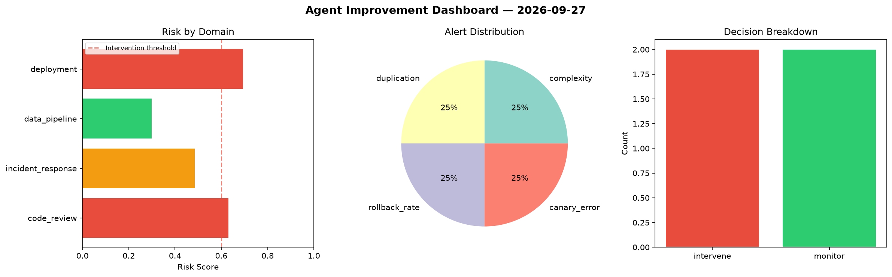
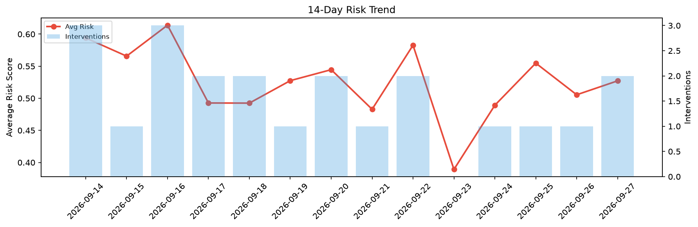

# Agent Improvement Report — 2026-09-27

**Cycle ID:** `5e301674` | **Avg Risk:** 0.5272 | **Interventions:** 2/4

## Risk Matrix

| Domain | Risk Score | Decision | Alerts |
|--------|-----------|----------|--------|
| code_review | 0.6307 | intervene | complexity, duplication |
| incident_response | 0.4845 | monitor | none |
| data_pipeline | 0.2993 | monitor | none |
| deployment | 0.6945 | intervene | rollback_rate, canary_error |

## Delta vs Yesterday

| Domain | Today | Yesterday | Change |
|--------|-------|-----------|--------|
| code_review | 0.6307 | 0.421 | 📈 49.8% |
| incident_response | 0.4845 | 0.4666 | 📈 3.8% |
| data_pipeline | 0.2993 | 0.7272 | 📉 -58.8% |
| deployment | 0.6945 | 0.4073 | 📈 70.5% |

**Refinement:** `{'adjustment': 'tighten_thresholds', 'trend': 'degrading', 'window': 4}`