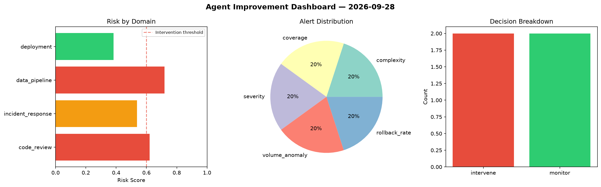
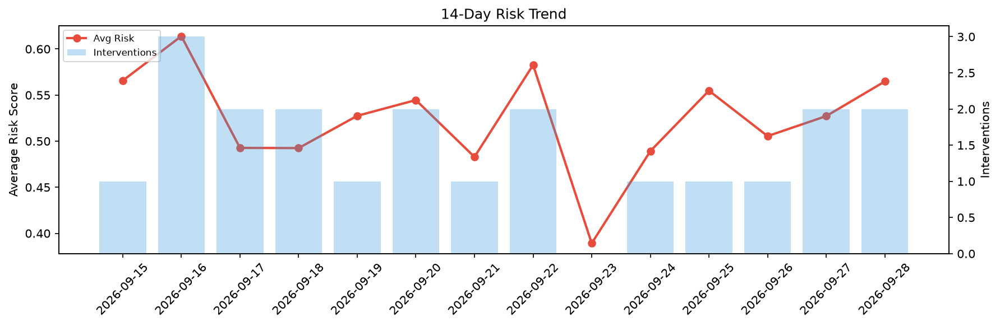

# Agent Improvement Report — 2026-09-28

**Cycle ID:** `50986293` | **Avg Risk:** 0.5648 | **Interventions:** 2/4

## Risk Matrix

| Domain | Risk Score | Decision | Alerts |
|--------|-----------|----------|--------|
| code_review | 0.6208 | intervene | complexity, coverage |
| incident_response | 0.5377 | monitor | severity |
| data_pipeline | 0.7188 | intervene | volume_anomaly |
| deployment | 0.3821 | monitor | rollback_rate |

## Delta vs Yesterday

| Domain | Today | Yesterday | Change |
|--------|-------|-----------|--------|
| code_review | 0.6208 | 0.6307 | 📉 -1.6% |
| incident_response | 0.5377 | 0.4845 | 📈 11.0% |
| data_pipeline | 0.7188 | 0.2993 | 📈 140.2% |
| deployment | 0.3821 | 0.6945 | 📉 -45.0% |

**Refinement:** `{'adjustment': 'maintain', 'trend': 'improving', 'window': 4}`