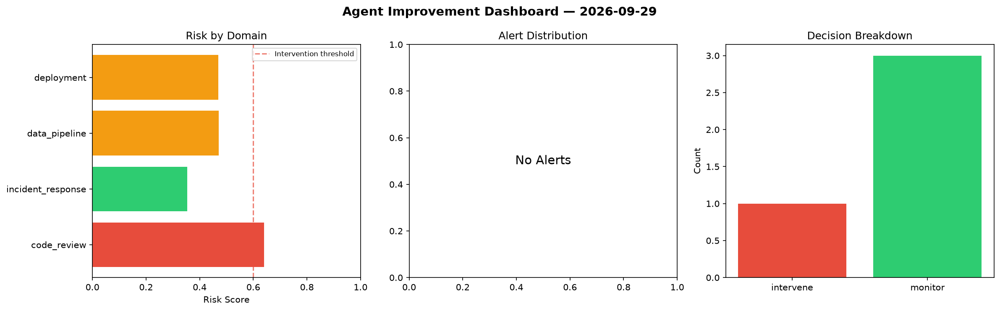
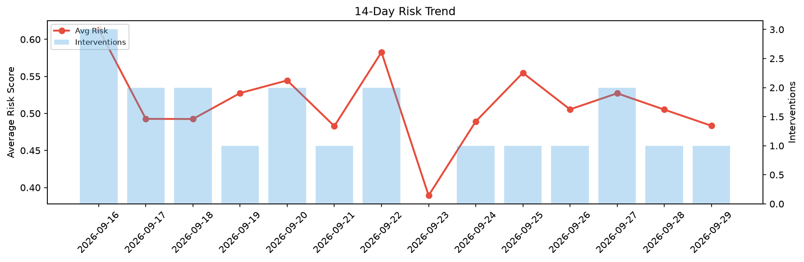

# Agent Improvement Report — 2026-09-29

**Cycle ID:** `793b0974` | **Avg Risk:** 0.4834 | **Interventions:** 1/4

## Risk Matrix

| Domain | Risk Score | Decision | Alerts |
|--------|-----------|----------|--------|
| code_review | 0.6399 | intervene | none |
| incident_response | 0.3536 | monitor | none |
| data_pipeline | 0.4712 | monitor | none |
| deployment | 0.4688 | monitor | none |

## Delta vs Yesterday

| Domain | Today | Yesterday | Change |
|--------|-------|-----------|--------|
| code_review | 0.6399 | 0.5069 | 📈 26.2% |
| incident_response | 0.3536 | 0.6934 | 📉 -49.0% |
| data_pipeline | 0.4712 | 0.4161 | 📈 13.2% |
| deployment | 0.4688 | 0.4045 | 📈 15.9% |

**Refinement:** `{'adjustment': 'maintain', 'trend': 'improving', 'window': 4}`