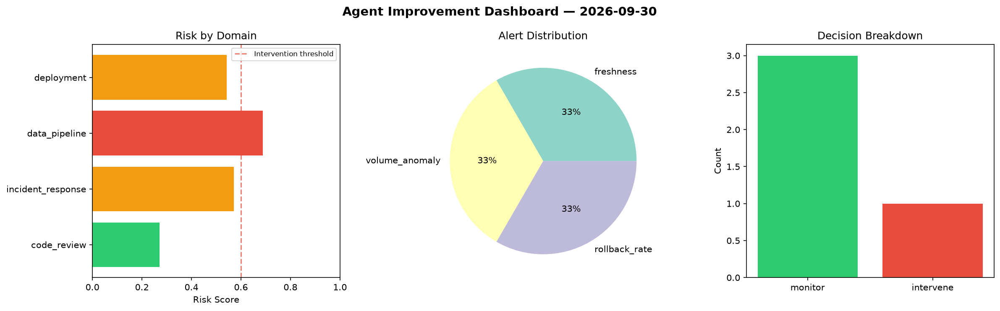
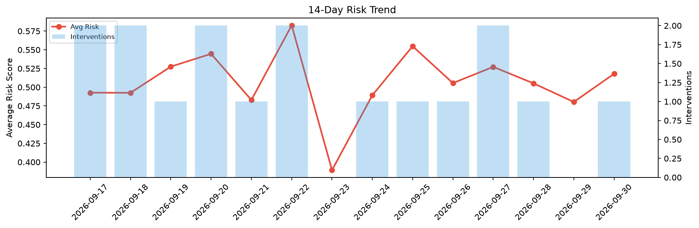

# Agent Improvement Report — 2026-09-30

**Cycle ID:** `5c587eb8` | **Avg Risk:** 0.518 | **Interventions:** 1/4

## Risk Matrix

| Domain | Risk Score | Decision | Alerts |
|--------|-----------|----------|--------|
| code_review | 0.2712 | monitor | none |
| incident_response | 0.5707 | monitor | none |
| data_pipeline | 0.6878 | intervene | freshness, volume_anomaly |
| deployment | 0.5423 | monitor | rollback_rate |

## Delta vs Yesterday

| Domain | Today | Yesterday | Change |
|--------|-------|-----------|--------|
| code_review | 0.2712 | 0.357 | 📉 -24.0% |
| incident_response | 0.5707 | 0.4685 | 📈 21.8% |
| data_pipeline | 0.6878 | 0.5207 | 📈 32.1% |
| deployment | 0.5423 | 0.5748 | 📉 -5.7% |

**Refinement:** `{'adjustment': 'tighten_thresholds', 'trend': 'degrading', 'window': 4}`