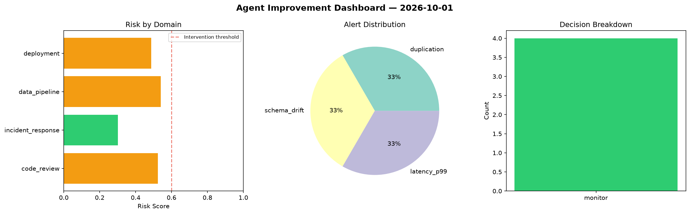
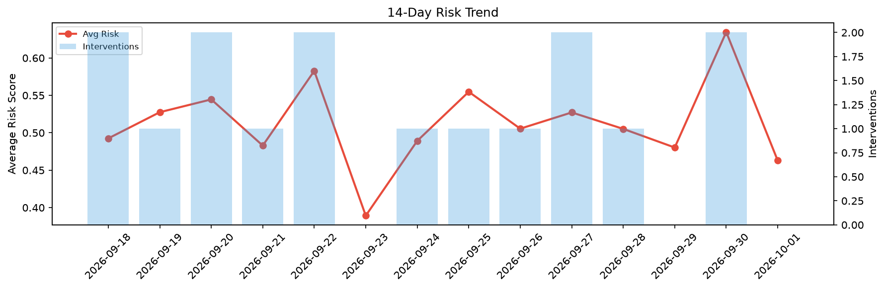

# Agent Improvement Report — 2026-10-01

**Cycle ID:** `c8e86e53` | **Avg Risk:** 0.4628 | **Interventions:** 0/4

## Risk Matrix

| Domain | Risk Score | Decision | Alerts |
|--------|-----------|----------|--------|
| code_review | 0.5233 | monitor | duplication |
| incident_response | 0.3011 | monitor | none |
| data_pipeline | 0.5402 | monitor | schema_drift |
| deployment | 0.4865 | monitor | latency_p99 |

## Delta vs Yesterday

| Domain | Today | Yesterday | Change |
|--------|-------|-----------|--------|
| code_review | 0.5233 | 0.5674 | 📉 -7.8% |
| incident_response | 0.3011 | 0.5605 | 📉 -46.3% |
| data_pipeline | 0.5402 | 0.6038 | 📉 -10.5% |
| deployment | 0.4865 | 0.8068 | 📉 -39.7% |

**Refinement:** `{'adjustment': 'maintain', 'trend': 'improving', 'window': 4}`