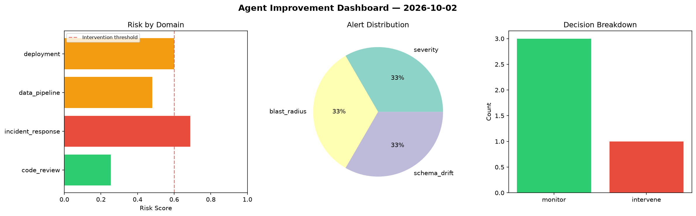
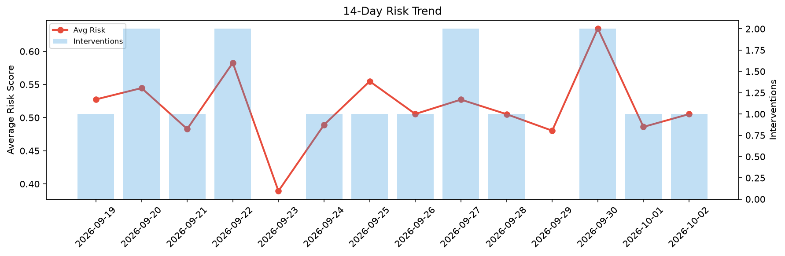

# Agent Improvement Report — 2026-10-02

**Cycle ID:** `a4ff6dfa` | **Avg Risk:** 0.5053 | **Interventions:** 1/4

## Risk Matrix

| Domain | Risk Score | Decision | Alerts |
|--------|-----------|----------|--------|
| code_review | 0.2528 | monitor | none |
| incident_response | 0.6882 | intervene | severity, blast_radius |
| data_pipeline | 0.4802 | monitor | schema_drift |
| deployment | 0.6 | monitor | none |

## Delta vs Yesterday

| Domain | Today | Yesterday | Change |
|--------|-------|-----------|--------|
| code_review | 0.2528 | 0.2265 | 📈 11.6% |
| incident_response | 0.6882 | 0.427 | 📈 61.2% |
| data_pipeline | 0.4802 | 0.6904 | 📉 -30.4% |
| deployment | 0.6 | 0.6 | ➡️ 0.0% |

**Refinement:** `{'adjustment': 'tighten_thresholds', 'trend': 'degrading', 'window': 4}`