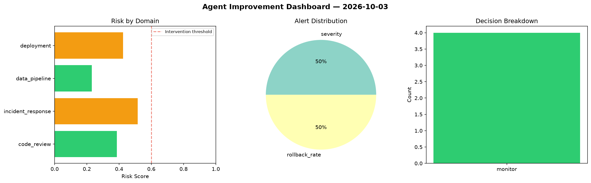
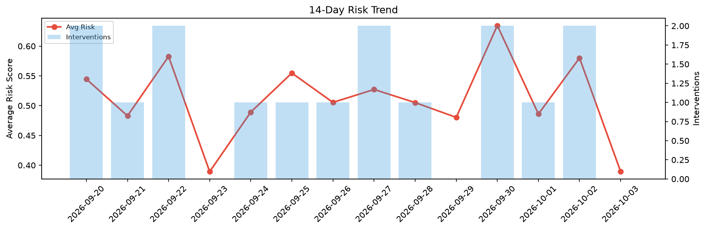

# Agent Improvement Report — 2026-10-03

**Cycle ID:** `79e0a057` | **Avg Risk:** 0.3895 | **Interventions:** 0/4

## Risk Matrix

| Domain | Risk Score | Decision | Alerts |
|--------|-----------|----------|--------|
| code_review | 0.3867 | monitor | none |
| incident_response | 0.516 | monitor | severity |
| data_pipeline | 0.2304 | monitor | none |
| deployment | 0.4249 | monitor | rollback_rate |

## Delta vs Yesterday

| Domain | Today | Yesterday | Change |
|--------|-------|-----------|--------|
| code_review | 0.3867 | 0.7279 | 📉 -46.9% |
| incident_response | 0.516 | 0.5574 | 📉 -7.4% |
| data_pipeline | 0.2304 | 0.6619 | 📉 -65.2% |
| deployment | 0.4249 | 0.3732 | 📈 13.9% |

**Refinement:** `{'adjustment': 'tighten_thresholds', 'trend': 'degrading', 'window': 4}`