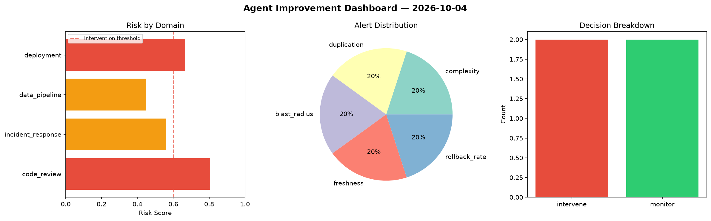
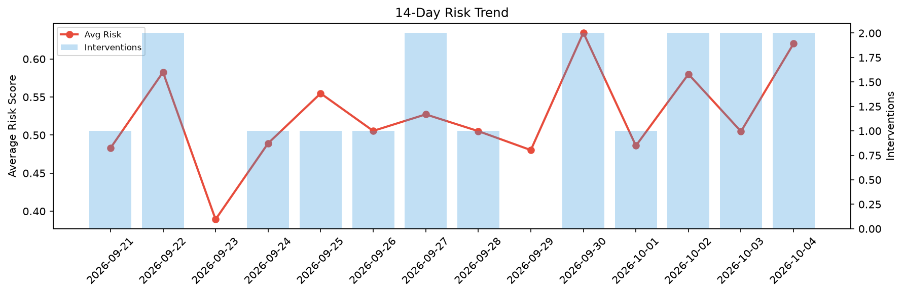

# Agent Improvement Report — 2026-10-04

**Cycle ID:** `a7dfaf04` | **Avg Risk:** 0.6201 | **Interventions:** 2/4

## Risk Matrix

| Domain | Risk Score | Decision | Alerts |
|--------|-----------|----------|--------|
| code_review | 0.8058 | intervene | complexity, duplication |
| incident_response | 0.561 | monitor | blast_radius |
| data_pipeline | 0.4475 | monitor | freshness |
| deployment | 0.666 | intervene | rollback_rate |

## Delta vs Yesterday

| Domain | Today | Yesterday | Change |
|--------|-------|-----------|--------|
| code_review | 0.8058 | 0.6106 | 📈 32.0% |
| incident_response | 0.561 | 0.6095 | 📉 -8.0% |
| data_pipeline | 0.4475 | 0.2502 | 📈 78.9% |
| deployment | 0.666 | 0.5489 | 📈 21.3% |

**Refinement:** `{'adjustment': 'maintain', 'trend': 'improving', 'window': 4}`