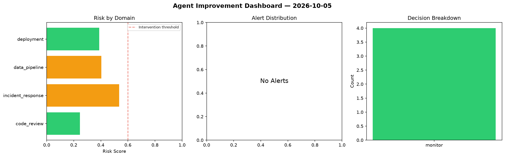
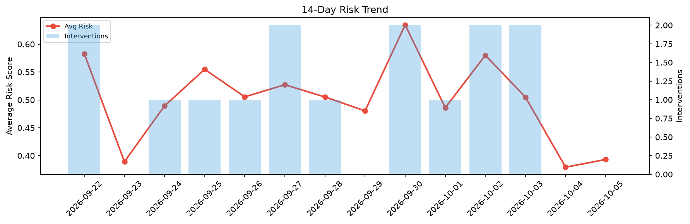

# Agent Improvement Report — 2026-10-05

**Cycle ID:** `823d2d29` | **Avg Risk:** 0.3931 | **Interventions:** 0/4

## Risk Matrix

| Domain | Risk Score | Decision | Alerts |
|--------|-----------|----------|--------|
| code_review | 0.2461 | monitor | none |
| incident_response | 0.5351 | monitor | none |
| data_pipeline | 0.4034 | monitor | none |
| deployment | 0.3878 | monitor | none |

## Delta vs Yesterday

| Domain | Today | Yesterday | Change |
|--------|-------|-----------|--------|
| code_review | 0.2461 | 0.5476 | 📉 -55.1% |
| incident_response | 0.5351 | 0.3435 | 📈 55.8% |
| data_pipeline | 0.4034 | 0.2712 | 📈 48.7% |
| deployment | 0.3878 | 0.355 | 📈 9.2% |

**Refinement:** `{'adjustment': 'tighten_thresholds', 'trend': 'degrading', 'window': 4}`