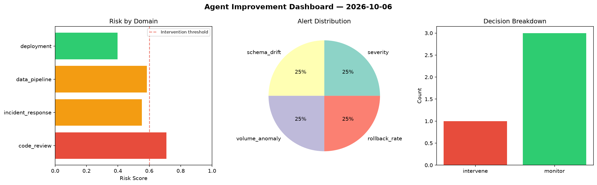
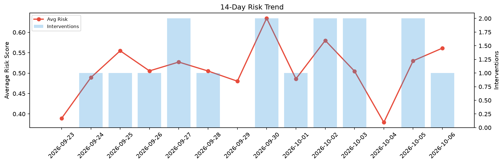

# Agent Improvement Report — 2026-10-06

**Cycle ID:** `9fbc3162` | **Avg Risk:** 0.5613 | **Interventions:** 1/4

## Risk Matrix

| Domain | Risk Score | Decision | Alerts |
|--------|-----------|----------|--------|
| code_review | 0.71 | intervene | none |
| incident_response | 0.5533 | monitor | severity |
| data_pipeline | 0.5842 | monitor | schema_drift, volume_anomaly |
| deployment | 0.3977 | monitor | rollback_rate |

## Delta vs Yesterday

| Domain | Today | Yesterday | Change |
|--------|-------|-----------|--------|
| code_review | 0.71 | 0.5961 | 📈 19.1% |
| incident_response | 0.5533 | 0.2709 | 📈 104.2% |
| data_pipeline | 0.5842 | 0.615 | 📉 -5.0% |
| deployment | 0.3977 | 0.6389 | 📉 -37.8% |

**Refinement:** `{'adjustment': 'maintain', 'trend': 'improving', 'window': 4}`