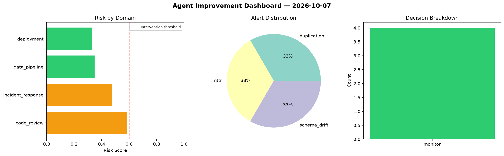
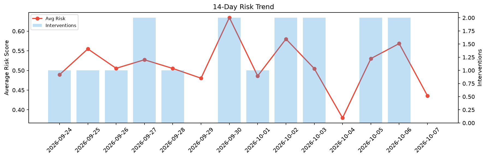

# Agent Improvement Report — 2026-10-07

**Cycle ID:** `4387e2e4` | **Avg Risk:** 0.4355 | **Interventions:** 0/4

## Risk Matrix

| Domain | Risk Score | Decision | Alerts |
|--------|-----------|----------|--------|
| code_review | 0.584 | monitor | duplication |
| incident_response | 0.4771 | monitor | mttr |
| data_pipeline | 0.3494 | monitor | schema_drift |
| deployment | 0.3315 | monitor | none |

## Delta vs Yesterday

| Domain | Today | Yesterday | Change |
|--------|-------|-----------|--------|
| code_review | 0.584 | 0.6777 | 📉 -13.8% |
| incident_response | 0.4771 | 0.452 | 📈 5.6% |
| data_pipeline | 0.3494 | 0.5156 | 📉 -32.2% |
| deployment | 0.3315 | 0.6285 | 📉 -47.3% |

**Refinement:** `{'adjustment': 'maintain', 'trend': 'improving', 'window': 4}`