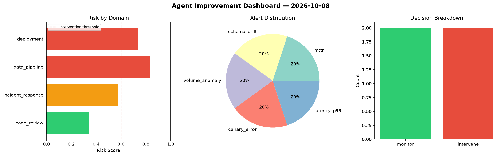
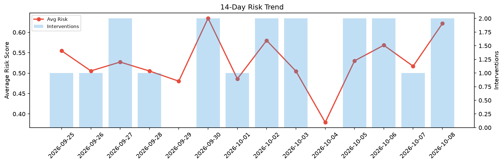

# Agent Improvement Report — 2026-10-08

**Cycle ID:** `f5422acd` | **Avg Risk:** 0.6217 | **Interventions:** 2/4

## Risk Matrix

| Domain | Risk Score | Decision | Alerts |
|--------|-----------|----------|--------|
| code_review | 0.3385 | monitor | none |
| incident_response | 0.576 | monitor | mttr |
| data_pipeline | 0.8368 | intervene | schema_drift, volume_anomaly |
| deployment | 0.7355 | intervene | canary_error, latency_p99 |

## Delta vs Yesterday

| Domain | Today | Yesterday | Change |
|--------|-------|-----------|--------|
| code_review | 0.3385 | 0.5978 | 📉 -43.4% |
| incident_response | 0.576 | 0.4255 | 📈 35.4% |
| data_pipeline | 0.8368 | 0.4416 | 📈 89.5% |
| deployment | 0.7355 | 0.6032 | 📈 21.9% |

**Refinement:** `{'adjustment': 'tighten_thresholds', 'trend': 'degrading', 'window': 4}`