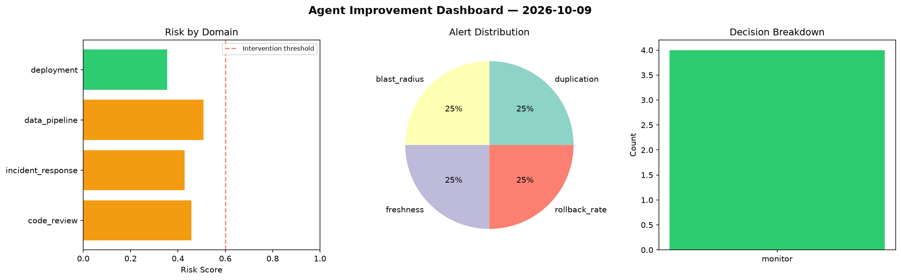
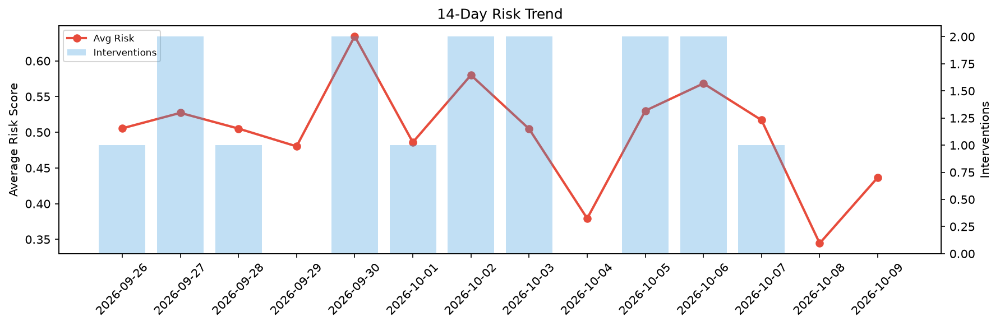

# Agent Improvement Report — 2026-10-09

**Cycle ID:** `4e8301a3` | **Avg Risk:** 0.4368 | **Interventions:** 0/4

## Risk Matrix

| Domain | Risk Score | Decision | Alerts |
|--------|-----------|----------|--------|
| code_review | 0.4562 | monitor | duplication |
| incident_response | 0.4281 | monitor | blast_radius |
| data_pipeline | 0.5079 | monitor | freshness |
| deployment | 0.3549 | monitor | rollback_rate |

## Delta vs Yesterday

| Domain | Today | Yesterday | Change |
|--------|-------|-----------|--------|
| code_review | 0.4562 | 0.1752 | 📈 160.4% |
| incident_response | 0.4281 | 0.3717 | 📈 15.2% |
| data_pipeline | 0.5079 | 0.2699 | 📈 88.2% |
| deployment | 0.3549 | 0.5613 | 📉 -36.8% |

**Refinement:** `{'adjustment': 'maintain', 'trend': 'improving', 'window': 4}`