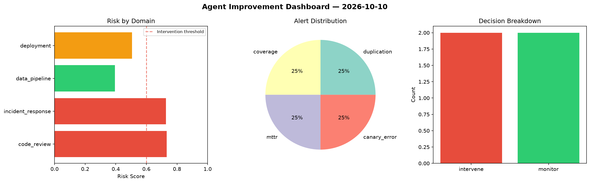
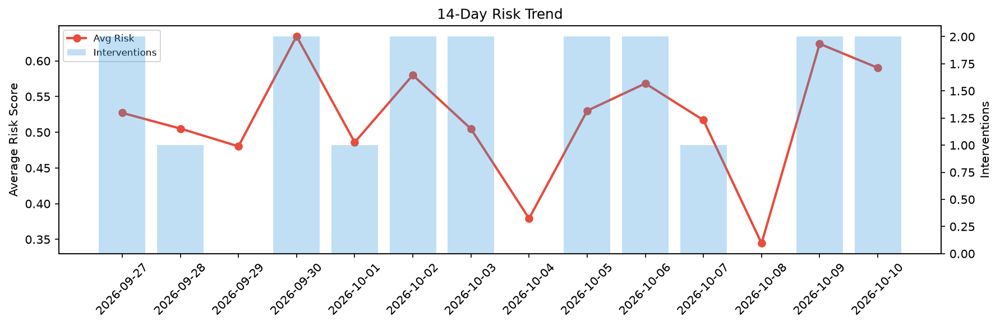

# Agent Improvement Report — 2026-10-10

**Cycle ID:** `b8ddac22` | **Avg Risk:** 0.5903 | **Interventions:** 2/4

## Risk Matrix

| Domain | Risk Score | Decision | Alerts |
|--------|-----------|----------|--------|
| code_review | 0.7333 | intervene | duplication, coverage |
| incident_response | 0.7272 | intervene | mttr |
| data_pipeline | 0.3948 | monitor | none |
| deployment | 0.5059 | monitor | canary_error |

## Delta vs Yesterday

| Domain | Today | Yesterday | Change |
|--------|-------|-----------|--------|
| code_review | 0.7333 | 0.7127 | 📈 2.9% |
| incident_response | 0.7272 | 0.51 | 📈 42.6% |
| data_pipeline | 0.3948 | 0.4183 | 📉 -5.6% |
| deployment | 0.5059 | 0.8544 | 📉 -40.8% |

**Refinement:** `{'adjustment': 'maintain', 'trend': 'improving', 'window': 4}`